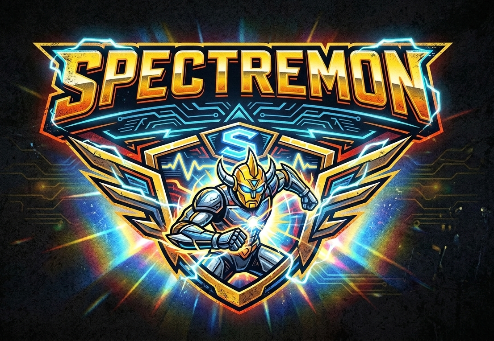

# Spectremon: Spec-Driven Development Framework



Spectremon is an on-demand, multi-agent orchestration framework for Claude Code. It enforces a rigorous Spec-Driven Development (SDD) lifecycle by coordinating an Orchestrator with three specialized subagents: Discovery, Implementer, and Architect.

## Installation

Run the installer from your project root. No global install required.

**With npm:**
```bash
npx spectremon
```

**With Bun:**
```bash
bunx spectremon
```

Or run directly from GitHub without installing:

```bash
# npm
npx github:genehuh39/spectremon

# Bun
bunx github:genehuh39/spectremon
```

The installer writes the following into your project:

```text
/your-project-root
  ├── CLAUDE.md                  # Appended with the Spectremon trigger
  └── .claude/
       ├── spectremon.md         # Orchestrator instructions
       └── agents/
            ├── discovery.md     # Phase 1 & 2: Requirements & Architecture
            ├── implementer.md   # Phase 3: Coding
            └── architect.md     # Phase 4: Review & Verification
```

## Usage

Once installed, trigger the framework inside Claude Code by saying:

> "Start Spectremon" or "Boot up the Orchestrator"

Claude will adopt the Orchestrator persona and begin the SDD workflow.

## How It Works

Spectremon enforces a four-phase development loop with two distinct spec modes.

### Spec Modes

Spectremon supports two modes based on your development needs:

#### Feature Mode
For building new features and capabilities. Creates:
- `requirements.md` - EARS-formatted functional requirements
- `design.md` - Technical architecture
- `tasks.md` - Implementation checklist

**Automatic Detection:** Default mode when no bug keywords are detected.

**Explicit Override:** Start your request with `/feature` to force this mode.

#### Bugfix Mode
For systematically diagnosing and fixing bugs. Creates:
- `bugfix.md` - Current, expected, and unchanged behavior analysis
- `design.md` - Fix approach and strategy
- `tasks.md` - Fix and verification checklist

**Automatic Detection:** Triggered by keywords like "bug", "fix", "issue", "error", "broken", "crash", "not working", "fails".

**Explicit Override:** Start your request with `/bugfix` to force this mode.

### EARS Notation

All requirements in Spectremon are written using Easy Approach to Requirements Syntax (EARS), a structured format that makes requirements clear and testable.

#### Syntax Patterns

- **When** [trigger/event], the system shall [system response]
- **While** [condition/state], the system shall [ongoing behavior]
- **If** [condition], then the system shall [action]
- **Where** [context/location], the system shall [behavior]

#### Examples

**Feature Requirements:**
```markdown
# Requirements: User Authentication System

## Functional Requirements

FR-1: When the user submits valid credentials, the system shall authenticate the user within 2 seconds.

FR-2: If authentication fails, the system shall display an error message without revealing which field was incorrect.

FR-3: While the user session is active, the system shall refresh the authentication token every 15 minutes.
```

**Bugfix Analysis:**
```markdown
# Bugfix: Login Form Validation Crash

## Current Behavior
When the user clicks submit with empty required fields, the application crashes with:
```
TypeError: Cannot read property 'trim' of undefined
```

## Expected Behavior
When the user clicks submit with empty required fields, the system shall display inline validation errors for each empty field without crashing.

## Unchanged Behavior
- Valid form submissions shall continue to process normally
- Existing validation rules for email format shall remain
- Error message styling shall not change
```

### Phase 1 & 2 — Discovery

The **Discovery** subagent translates your request into three spec files stored in `.sdd/`:

| File | Contents | Mode |
|------|----------|------|
| `requirements.md` | Scope, constraints, and EARS-formatted requirements | Feature |
| `bugfix.md` | Current/expected behavior analysis and regression prevention | Bugfix |
| `design.md` | Technical architecture and design decisions | Both |
| `tasks.md` | Atomic implementation checklist (`- [ ]`) | Both |

The Orchestrator does not proceed until you explicitly approve:
1. The detected mode (Feature vs Bugfix)
2. The archive name for previous specs
3. The generated spec files

### Phase 3 — Implementation

The **Implementer** subagent executes one task at a time from `tasks.md`. It is strictly scoped to the files required for that task and aligns all code against `design.md`.

### Phase 4 — Verification

The **Architect** subagent reviews every change before it is marked complete. It checks:

- Architectural conformance against `design.md`
- Security vulnerabilities (injection, unvalidated inputs, improper state)
- Functional correctness via automated tests or REPL execution
- Regression prevention (for bugfixes)

For React/UI tasks, it renders components headlessly and asserts the output. A task is only marked `[x]` after the Architect replies **"REVIEW PASSED"**.

### Correction Loop

If the Implementer fails the Architect's review **3 times** on the same task, the Orchestrator halts, summarizes the blocker, and proposes spec changes for your approval before continuing.

## State Management

All spec state lives in `.sdd/` at your project root. This directory is treated as read-only outside of Spectremon mode.

```text
/your-project-root
  └── .sdd/
       ├── requirements.md     # or bugfix.md for bugfixes
       ├── design.md
       ├── tasks.md
       └── archive/              # Previous specs with descriptive names
            ├── 2026-03-09-user-authentication/
            ├── 2026-03-08-payment-webhook-fix/
            └── ...
```

### Archive Naming

When starting a new feature or bugfix, the Orchestrator archives any existing `.sdd/` files with a descriptive name:

**Format:** `.sdd/archive/YYYY-MM-DD-{descriptive-name}/`

**Examples:**
- `2026-03-09-user-authentication/`
- `2026-03-08-payment-webhook-timeout-fix/`
- `2026-03-07-dashboard-admin-filtering/`

The name is auto-extracted from your request and confirmed with you before archiving.

## Best Practices

### When to Use Feature Mode
- Building new capabilities
- Adding new user-facing functionality
- Implementing system improvements

### When to Use Bugfix Mode
- Fixing crashes or errors
- Addressing unexpected behavior
- Resolving regressions

### Writing Good EARS Requirements
1. **Be specific**: Use concrete triggers, conditions, and responses
2. **Include criteria**: Add quantifiable measures (time, count, etc.) when possible
3. **One requirement per line**: Keep requirements atomic
4. **Use "shall"**: Indicates mandatory requirements
5. **Cover edge cases**: Include "If" conditions for error handling

### Preventing Regressions in Bugfixes
The **Unchanged Behavior** section in `bugfix.md` is critical for preventing regressions. Always document:
- Existing functionality that must continue working
- Features that should not be affected
- Behaviors that must remain identical

## License

MIT © [genehuh39](https://github.com/genehuh39)
